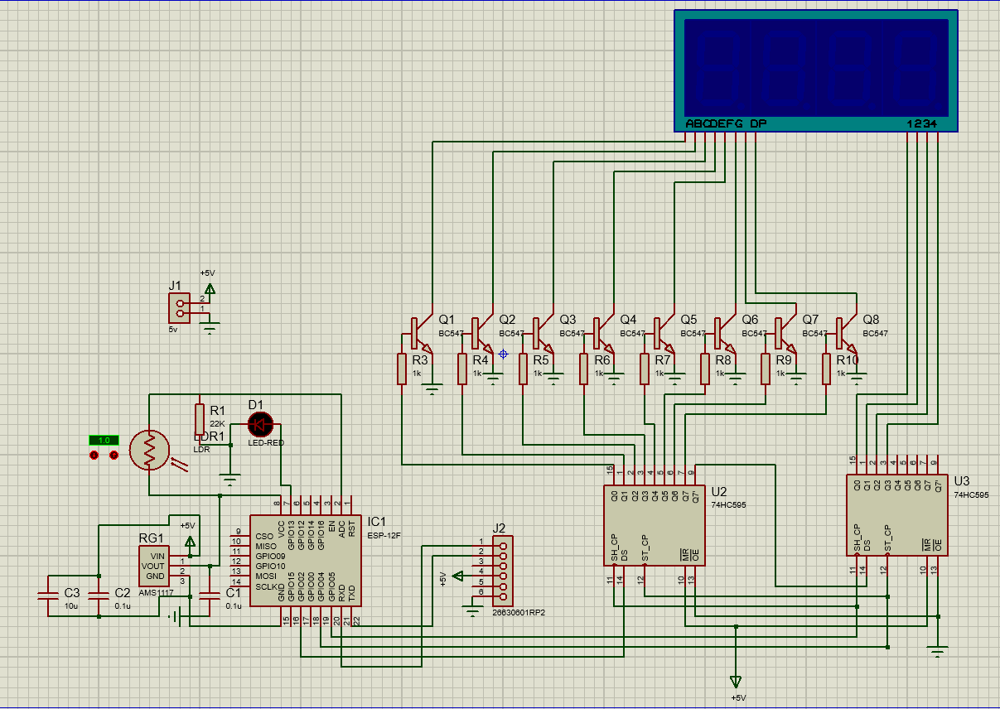

# ESP8266 WiFi NTP Clock

<p align="center">
  
  
  
</p>

## Features

- **WiFi Connectivity:** Uses the ESP8266 to connect to your WiFi network.
- **NTP Time Synchronization:** Synchronizes time with an NTP server to ensure accurate timekeeping.
- **7-Segment Display:** Displays hours and minutes on a 7-segment display controlled via shift registers.
- **Adjustable Brightness:** Automatically adjusts the display brightness based on ambient light using an LDR (Light Dependent Resistor).
- **Auto-Reboot:** Automatically reboots the ESP8266 every 24 hours to ensure stability.
- **WiFiManager:** Simplifies WiFi configuration with a web-based setup page.

## Getting Started

Prerequisites

    Arduino IDE installed on your computer.
    ESP8266 board package installed in Arduino IDE.
    Basic knowledge of electronics and soldering.

## Components Used

- ESP8266
- 74HC595 Shift Registers
- 7-Segment Display / Make it yourself using LEDs
- NPN transistors (4 pieces) for each digit
- LDR (Light Dependent Resistor)
- LED Indicator
- Push Button for WiFi Reset

## Schematic



## How It Works

1. **Initialization:** The ESP8266 connects to the configured WiFi network using the WiFiManager library. If the connection fails, it enters WiFi setup mode.
2. **NTP Synchronization:** The ESP8266 fetches the current time from an NTP server (`in.pool.ntp.org`) and calculates the local time with the specified timezone correction.
3. **Display Update:** The time is displayed on a 7-segment display using shift registers. The display is updated every second.
4. **Brightness Adjustment:** The brightness of the display is adjusted every 10 milliseconds based on the ambient light detected by the LDR.
5. **LED Indicator:** An LED blinks every 500 milliseconds to indicate the clock is running.
6. **Automatic Reboot:** The ESP8266 reboots every 24 hours to ensure the system remains stable and responsive.

## Code Overview

### Libraries Used

- `ESP8266WiFi.h`: Manages WiFi connections.
- `WiFiManager.h`: Simplifies WiFi setup and connection.
- `WiFiUdp.h`: Handles UDP communication for NTP.
- `Ticker.h`: Provides periodic interrupt functionality.

### Key Functions

- `setup()`: Initializes the ESP8266, connects to WiFi, sets up timers, and fetches the initial time.
- `loop()`: Continuously updates the display and checks for button presses to reset WiFi settings.
- `getDateTime()`: Fetches the current time from the NTP server and sets the epoch time.
- `displayDigit()`: Sends data to the shift registers to update the 7-segment display.
- `adjustBrightness()`: Adjusts the display brightness based on the LDR reading.
- `updateDisplay()`: Updates the display with the current time.
- `tick()`: Increments the time by one second and updates the hour, minute, and second variables.
- `reboot()`: Reboots the ESP8266.

## Code

```cpp
#include < esp8266wifi.h >
#include < wificlient.h >
#include < wifiudp.h >
#include < ntpclient.h >

Ticker ticker;
Ticker Timer500ms;
Ticker BrightnessTicker;
Ticker tickerRefresh;

WiFiManager wifiMn;

unsigned int localPort = 123; // local port to listen for UDP packets

IPAddress timeServerIP; // time.nist.gov NTP server address
const char *ntpServerName = "in.pool.ntp.org";
const int NTP_PACKET_SIZE = 48;     // NTP time stamp is in the first 48 bytes of the message
byte packetBuffer[NTP_PACKET_SIZE]; // buffer to hold incoming and outgoing packets
WiFiUDP udp;

unsigned long epoch;
bool res;

double timeZoneCorrection = 5.30;
const int rebootEvery = 60 * 60 * 24;

const int flashButtonPin = 0;

const int dataPin = 2;  // DS pin of 74HC595
const int clockPin = 5; // SH_CP pin of 74HC595
const int latchPin = 4; // ST_CP pin of 74HC595
const int oePin = 14;   // OE pin of 74HC595 (connect to a PWM-capable pin)
const int ldrPin = A0;  // LDR connected to A0
const int LEDpin = 13;  // Pin connected to LED

bool Led = 0;

const byte segmentPatterns[10] = {
    0b11111100, // 0
    0b01100000, // 1
    0b11011010, // 2
    0b11110010, // 3
    0b01100110, // 4
    0b10110110, // 5
    0b10111110, // 6
    0b11100000, // 7
    0b11111110, // 8
    0b11110110  // 9
};

// Array to store the digits to be displayed
int digits[4] = {0b00010000, 0b00100000, 0b01000000, 0b10000000};

void displayDigit(int digit, int position)
{
    // Disable all digits
    digitalWrite(latchPin, LOW);

    // For digits (set the current digit high and others low)
    shiftOut(dataPin, clockPin, LSBFIRST, position);

    // Send segment data to the shift registers
    shiftOut(dataPin, clockPin, LSBFIRST, segmentPatterns[digit]);

    // Latch the data
    digitalWrite(latchPin, HIGH);
}

int hours, minutes, seconds;

void tick()
{
    /*
     * Executed every 1 second
     */
    hours = ((epoch + 19800) % 86400L) / 3600;
    minutes = ((epoch + 19800) % 3600) / 60;
    seconds = (epoch + 19800) % 60;

    // Add 1 second
    epoch++;
    Serial.println(hours);
    Serial.println(minutes);
}

void Setiap500ms()
{
    Led = !Led;
    digitalWrite(LEDpin, Led);
    if (Led == 1)
    {
        // Serial.println(hour * 100 + minute);
    }
}

void adjustBrightness()
{
    int ldrValue = analogRead(ldrPin);
    // Serial.println(ldrValue);
    int brightness = map(ldrValue, 100, 1023, 230, 0); // Map LDR value to PWM value (inverted)
    analogWrite(oePin, brightness);
}

void updateDisplay()
{
    displayDigit((int)(hours / 10), digits[0]);
    displayDigit((int)(hours % 10), digits[1]);
    displayDigit((int)(minutes / 10), digits[2]);
    displayDigit((int)(minutes % 10), digits[3]);
}

void reboot()
{
    disableDigits();
    ESP.restart();
}

void disableDigits()
{
    digitalWrite(latchPin, 0);
    shiftOut(dataPin, clockPin, LSBFIRST, 0b00000000);
    shiftOut(dataPin, clockPin, LSBFIRST, 0b00000000);
    digitalWrite(latchPin, 1);
}

void wifinotconnected()
{
    digitalWrite(LEDpin, 1);
    digitalWrite(latchPin, 0);
    shiftOut(dataPin, clockPin, LSBFIRST, 0b11110000);
    shiftOut(dataPin, clockPin, LSBFIRST, 0b11100000);
    digitalWrite(latchPin, 1);
}

void setup()
{

    Serial.begin(115200);

    // Set pins to output so you can control the shift register
    pinMode(latchPin, OUTPUT);
    pinMode(clockPin, OUTPUT);
    pinMode(dataPin, OUTPUT);
    pinMode(oePin, OUTPUT);         // OE pin for controlling brightness
    pinMode(LEDpin, OUTPUT);        // LED pin for blinking
    pinMode(flashButtonPin, INPUT); // Pin for resetting wifi credentials
    pinMode(ldrPin, INPUT);
    udp.begin(localPort);

    BrightnessTicker.attach_ms(10, adjustBrightness); // Adjust brightness every 250 milliseconds

    if (WiFi.status() != WL_CONNECTED)
        wifinotconnected();

    if (!wifiMn.autoConnect("Esp Web Server", "12345678"))
    {
        Serial.println("Failed to connect and hit timeout");
        ESP.reset();
        delay(1000);
    }

    Serial.println("Conected to Wifi");

    getDateTime();

    Timer500ms.attach_ms(500, Setiap500ms);

    tickerRefresh.attach(rebootEvery, reboot);
}

void loop()
{
    if (digitalRead(flashButtonPin) == LOW)
    {
        wifiMn.resetSettings();
        ESP.reset();
        Serial.println("Wifi settings reset");
        delay(1000);
    }
    updateDisplay();
}

/*
 *  The following code is based on the NTP Client example for ESP8266, more info on:
 *  https://github.com/esp8266/Arduino/blob/master/libraries/ESP8266WiFi/examples/NTPClient/NTPClient.ino
 */

unsigned long sendNTPpacket(IPAddress &address)
{
    memset(packetBuffer, 0, NTP_PACKET_SIZE);
    packetBuffer[0] = 0b11100011; // LI, Version, Mode
    packetBuffer[1] = 0;          // Stratum, or type of clock
    packetBuffer[2] = 6;          // Polling Interval
    packetBuffer[3] = 0xEC;       // Peer Clock Precision
    packetBuffer[12] = 49;
    packetBuffer[13] = 0x4E;
    packetBuffer[14] = 49;
    packetBuffer[15] = 52;

    udp.beginPacket(address, 123); // NTP requests are to port 123
    udp.write(packetBuffer, NTP_PACKET_SIZE);
    udp.endPacket();
}

void getDateTime()
{
    WiFi.hostByName(ntpServerName, timeServerIP);

    sendNTPpacket(timeServerIP);
    delay(1000);

    int cb = udp.parsePacket();
    if (!cb)
    {
        Serial.println("No packet yet");
    }
    else
    {
        udp.read(packetBuffer, NTP_PACKET_SIZE);
        unsigned long highWord = word(packetBuffer[40], packetBuffer[41]);
        unsigned long lowWord = word(packetBuffer[42], packetBuffer[43]);
        unsigned long secsSince1900 = highWord << 16 | lowWord;
        const unsigned long seventyYears = 2208988800UL;
        epoch = secsSince1900 - seventyYears;
        Serial.println(epoch);
        ticker.attach(1, tick);
    }
}
```

## Pictures


## Working Video

[](https://raw.githubusercontent.com/circuito-suman/Esp8266NTPClock/pages/assets/video.mp4)

Installation

    Clone the repository or download the zip file.
    Open the Arduino IDE and navigate to File > Open and select the .ino file from the repository.
    Connect your ESP8266 to your computer and select the appropriate board and port from Tools > Board and Tools > Port.
    Click on the upload button to upload the code to the ESP8266.

Configuration

    Power on the ESP8266. It will create a WiFi access point named "ESP Web Server" with the password "12345678".
    Connect to this access point using your phone or computer.
    Open a web browser and go to 192.168.4.1. You will see a WiFi configuration page.
    Enter your WiFi credentials and click save. The ESP8266 will reboot and connect to your WiFi network.

Usage

Once the ESP8266 is connected to your WiFi network, it will fetch the current time from the NTP server and display it on the 7-segment display. The brightness of the display will be adjusted automatically based on ambient light. The LED indicator will blink every 500 milliseconds to indicate the clock is running.

If you need to reset the WiFi settings, press the button connected to the flashButtonPin for a few seconds. The ESP8266 will enter WiFi setup mode again.
Contributing

If you find this project useful, please consider supporting it by giving it a star.

### Happy clock-making!

## About Me

👋 Hi, I'm Suman Saha, a Computer Science Engineering student passionate about technology and coding.

### Connect with Me

[](https://github.com/circuito-suman)

[](https://www.instagram.com/circuito_suman/)

[](http://www.linkedin.com/in/suman-saha-69ba5029a)

Feel free to reach out and connect with me on GitHub, Instagram and LinkedIn!

### Contributions are welcome! Please feel free to submit a pull request or open an issue to discuss changes.

## License

This project is licensed under the MIT License - see the [LICENSE](LICENSE) file for details.
